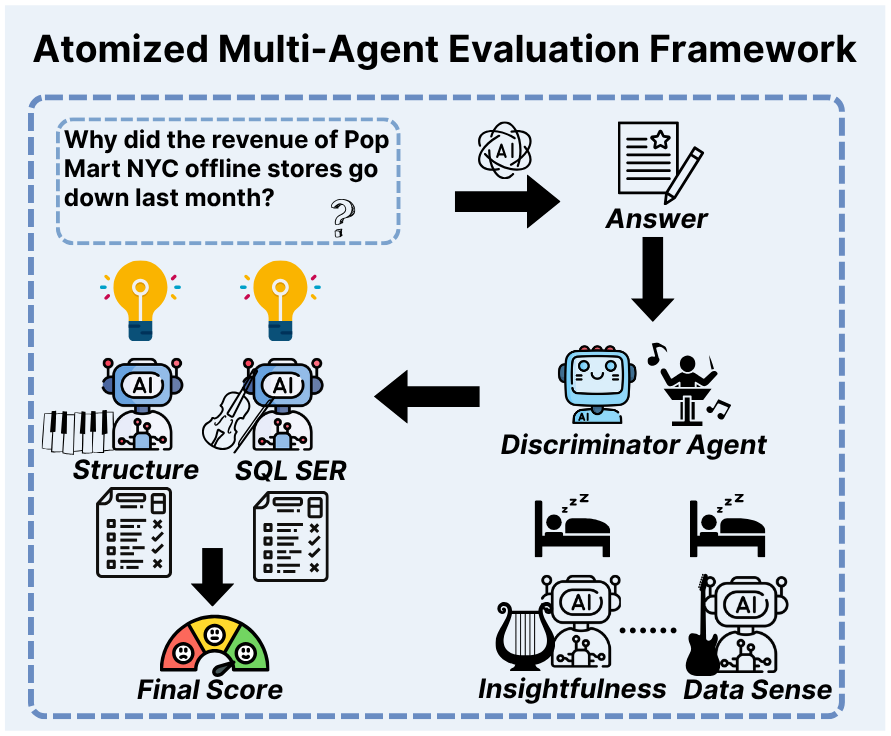
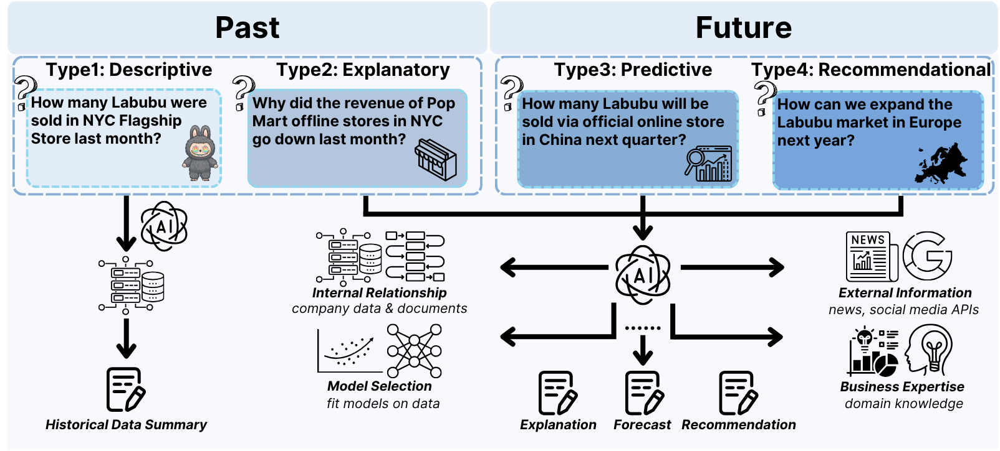

# CORGI: A New Text-to-SQL Benchmark for the Business Domain

---

## 🌐 Overview

**CORGI** is a new **text-to-SQL benchmark** specifically designed for **real-world business intelligence (BI)** contexts.  
Unlike existing datasets (e.g., Spider, WikiSQL, BIRD), CORGI moves beyond factual retrieval and challenges models to perform **causal reasoning**, **forecasting**, and **strategic recommendation** — mirroring real management consulting workflows.

> The benchmark draws inspiration from enterprises such as **Doordash**, **Airbnb**, and **Lululemon**, covering 10 major verticals across consumer platforms, retail, and digital services.

The dataset can also be downloaded from https://drive.google.com/drive/folders/1w3MjpcdeccC6XJ7ODYOL56-baoVgoPAe?usp=sharing 

---

## 📊 Key Contributions

- 🏢 **Business-Inspired Databases** — 10 synthetic but realistic databases modeled after real industries (food delivery, rentals, fashion, analytics, etc.)  
- 💬 **Four Categories of Business Queries**  

  | Type | Description | Example |
  |------|--------------|----------|
  | 1 | **Descriptive** | “What were the total sales on September 1, 2025?” |
  | 2 | **Explanatory** | “Why did the revenue of Pop Mart NYC go down last month?” |
  | 3 | **Predictive** | “How many Labubu will be sold online next quarter?” |
  | 4 | **Recommendational** | “How can we expand the Labubu market in Europe next year?” |

- ⚙️ **Atomized Multi-Agent Evaluation Framework** — a discriminator agent orchestrates seven specialized scoring agents evaluating structure, data sense, insightfulness, and compliance.  
- 🧠 **Business Literature-Inspired Evaluation** — derived from **MBA consulting frameworks** (McKinsey, BCG, Bain).

---

## 🧩 Framework Overview



*Figure 1: Multi-agent evaluation framework integrating business logic with schema-driven data simulation.*

---

## 💡 Query Taxonomy



*Figure 2: Four categories of business questions from descriptive retrieval to strategic recommendation.*

---

## 🧪 Methodology

1. **Schema Construction** — Extract operational logic from public business sources and construct relational schemas.  
2. **Data Simulation Rules** — Define **Business Operation Rules**, **Latent Feature Distributions**, and **Latent Seasonal Trends**.  
3. **Question Generation** — Generate and refine questions using Gemini 2.5–Flash-Lite.  
4. **Evaluation** — Combine **agent-based evaluation** with **human pairwise comparison** (Bradley–Terry framework).

---

## 📈 Benchmark Statistics

| Domain | Example Company | Model | Tables | Foreign Keys |
|---------|-----------------|--------|---------|--------------|
| Food Delivery | Doordash | B2C/B2B2C | 30 | 25 |
| Home Rental | Airbnb | C2C | 18 | 25 |
| Clothing | Lululemon | B2C | 34 | 40 |
| Freelancing | Upwork | C2C/C2B | 25 | 33 |
| App Store | Google Play | B2C | 18 | 22 |
| Car Rental | Turo | C2C | 30 | 68 |
| Luxury Consignment | The RealReal | C2C | 30 | 65 |
| Advertising Analytics | Ux_ad | B2B | 20 | 25 |
| Personalized Product | Persona Nutrition | B2C | 28 | 38 |
| E-Commerce Enablement | Shopify | B2B | 23 | 60 |

> CORGI databases contain **~26 tables per schema**, significantly larger and more complex than prior benchmarks like **BIRD (7.3)**.

---

## ⚖️ Evaluation Dimensions

| Dimension | Description |
|------------|--------------|
| **Structure** | Logical organization and argument coherence |
| **SQL SER** | Execution success rate of generated SQL |
| **Data Sense** | Correctness of data interpretation |
| **Insightfulness** | Ability to uncover causal or strategic insights |
| **Operational Implementability** | Practicality of proposed business actions |
| **Purpose Alignment** | Alignment with company’s goals |
| **Compliance** | Ethical and regulatory soundness (for Type 4) |

---

## 🧮 Results Summary

- **CORGI is 21% harder than BIRD**, reflecting higher reasoning difficulty.  
- **LLMs struggle with Type 4 (Recommendational)** tasks, indicating limits in strategic planning.  
- GPT-4o and Gemini 2.5 achieve SQL SER between **57–75%**, significantly below simple retrieval benchmarks.

---

## 🌍 Access

- **Dataset & Evaluation Framework:** [github.com/corgibenchmark/CORGI](https://github.com/corgibenchmark/CORGI)  
- **Online Evaluation Platform:** [txt2sql.com](https://txt2sql.com)  

---

## 🧾 Citation

If you use CORGI in your research, please cite:

```bibtex
@article{corgi2025,
  title={Agent Bain vs. Agent McKinsey: A New Text-to-SQL Benchmark for the Business Domain},
  author={Anonymous},
  year={2025},
  journal={ACL Submission},
}
